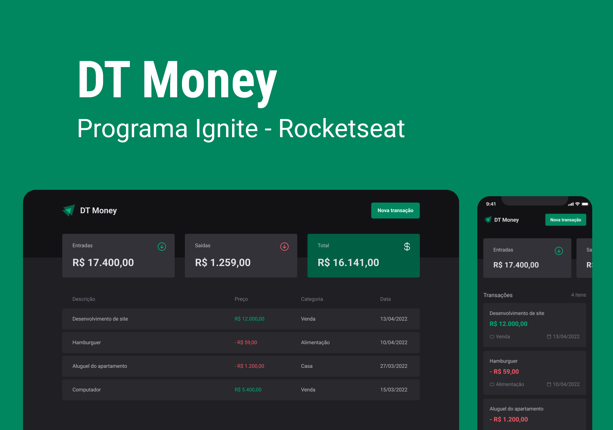

# <h1 align="center"> DT Money </h1>

 Aplicação desenvolvida por mim durante a jornada Ignite (Trilha React, módulo <i>Consumo de Api e perfomace no ReactJs</i> ) da Rocketseat.   Essa aplicação consiste em app de finanças, onde o usuário podera visualizar seus ganhos e gastos. 

  

## Stack utilizada

- ReactJS (Vite)
- Styled Components
- Radix 
- Zod + React Hook Form
- JSON server
- Typescript

## Conteúdos abordados

- Utilizar uma biblioteca externa de componentes para auxilar a criação de componentes mais acessíveis; 
- Utilização do json server para criar um backend para alimentar o frontend;
- Consumir dados da api utilizando axios;
- Funcionamento do fluxo de renderização do ReactJS;
- Otimização da aplicação utilizando hooks do React como useCallback e useMemo;

## Referência

- [Rocketseat](https://app.rocketseat.com.br/)
